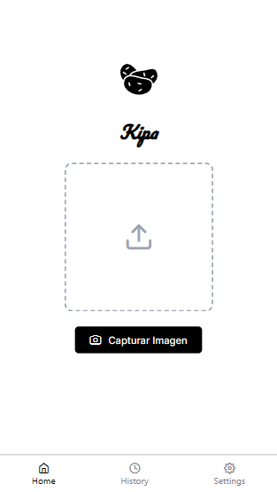
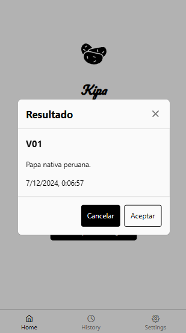

# Potato Scanner App

## Descripción

Potato Scanner es una aplicación que permite a los usuarios capturar imágenes de papas y obtener predicciones sobre la especie de la papa y la confianza de la predicción. La aplicación consta de una API desarrollada con FastAPI y una interfaz de usuario desarrollada con React Native.


## Requisitos

- Python 3.8+
- Node.js
- FastAPI
- ONNX Runtime
- Scikit-learn
- OpenCV
- React Native

## Instalación

### 1. Clonar el repositorio

```bash
git clone https://github.com/tu_usuario/potato_scanner.git
cd potato_scanner
```

### 2. Configurar y ejecutar la API

La API está ubicada en la carpeta `api` y se encuentra en el archivo `main.py`. Debes ejecutar la API primero para que la aplicación cliente pueda hacer las predicciones.

#### Instalar dependencias

```bash
cd api
pip install -r requirements.txt
```

#### Ejecutar la API

```bash
uvicorn main:app --reload
```

La API estará disponible en `http://localhost:8000`.

### 3. Configurar y ejecutar la aplicación cliente

#### Instalar dependencias

```bash
cd ../client
npm install
```

#### Ejecutar la aplicación

```bash
npm start
```

## Uso

1. Abre la aplicación cliente en tu dispositivo o emulador.
2. Captura una imagen de una papa usando la cámara o selecciona una imagen desde la galería.
3. La aplicación enviará la imagen a la API para obtener la predicción.
4. La predicción y la confianza se mostrarán en la pantalla.

## Capturas de pantalla




## Contribuciones

Las contribuciones son bienvenidas. Por favor, abre un issue o un pull request para discutir cualquier cambio que te gustaría realizar.

## Licencia

Este proyecto está bajo la Licencia MIT.
